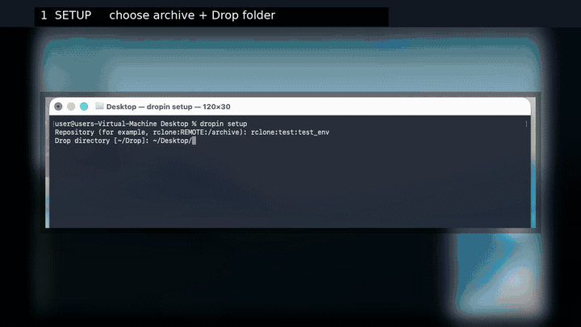

<div align="center">

# Dropin

### Drop files now. Find them later.

**A macOS workflow for turning a simple drop folder into a searchable archive you can inspect and restore from the CLI or through MCP.**

<br />



<br />
<br />

<code>Drop files</code> &nbsp;→&nbsp; <code>dropin drain</code> &nbsp;→&nbsp; <code>find</code> &nbsp;→&nbsp; <code>show</code> &nbsp;→&nbsp; <code>get</code>

<br />
<br />


</div>

---

Dropin is a **macOS storage offloader for files you want to keep but do not need
on your SSD**. Put a file, directory, or bundle in a drop folder and Dropin
captures it in an encrypted [restic](https://restic.net/) repository, together
with searchable metadata for later discovery and recovery.

> **The idea:** put files in `Drop` → archive them → search later → inspect before restoring → retrieve exactly what you need.

## At a glance

| Capture | Discover | Recover |
| --- | --- | --- |
| Drop files into `~/Drop` and run `dropin drain`. | Search by name, type, dates, tags, size, or metadata. | Inspect a match, then restore it to an explicit destination. |

Dropin is designed for things you want to keep, but do not want to file by hand.
Its major advantages are:

- **Reclaim local storage without losing the workflow:** files can leave your SSD
  while remaining searchable in Dropin's catalog and recoverable on demand.
- **Use remote storage you control:** encrypted archives can live on a NAS,
  S3-compatible storage, Backblaze B2, or another [rclone](https://rclone.org/)
  backend—without SaaS storage lock-in.
- **Recover through an MCP-enabled assistant:** Claude, Codex, and other MCP
  clients can find, inspect, and restore files using natural-language requests.
- **Delete conservatively:** Dropin verifies the archive, metadata, source
  stability, and removal conditions before deleting a local original. If any
  check is inconclusive, it leaves the original in place and reports why.

These checks reduce risk; they do not make data loss impossible.

## Why does it exist?

Traditional folder organization makes preservation depend on remembering where
everything belongs. Dropin separates **capture** from **organization**:

- drop items where they are convenient;
- search the local catalog by name, type, dates, tags, size, or metadata;
- restore an item later by its archive path;
- keep the archive encrypted while using [rclone](https://rclone.org/) to reach
  local or remote storage.

The safety boundary is deliberately conservative. Dropin does not delete a
source merely because an upload command succeeded; it verifies the archive,
catalog, source stability, and deletion conditions first.

## Data safety and privacy

Dropin intentionally deletes a source after its configured checks pass. For
irreplaceable data, keep an independent backup until you have tested remote-only
recovery and a restore. Terms such as “verified”, “safe”, and “supported” describe
the documented checks and validation scope, not a guarantee. The software is
provided without warranties under the terms in [`LICENSE`](LICENSE).

Restic encrypts the repository, but Dropin does not encrypt the drop folder, local
configuration or password file, state/catalog database, diagnostics, or restored
files. The catalog can contain filenames, paths, metadata, tags, comments, and
captured text; protect the Mac and backups accordingly. Restic, rclone, storage
providers, and MCP clients remain separate third-party software or services governed
by their own terms and security properties.

The MCP server runs locally over stdio, but an MCP client may send queries and tool
results—including names, paths, metadata, and captured text—to its model provider.
Review the client's permissions and the provider's privacy and retention terms before
connecting a private archive. See the [operator guide](docs/operator-guide.md) for
operational safeguards.

## Supported platform and prerequisites

Dropin v0.1.0 supports **macOS 26+ on Apple silicon**. It requires:

- Python 3.11 or newer
- restic 0.19.1
- rclone 1.75.1

The runtime has no third-party Python dependencies. Earlier macOS versions,
Intel Macs, and newer tool versions may work but are outside the documented
v0.1.0 validation matrix.

## Quickstart

The everyday workflow is intentionally tiny: run `dropin setup` once, drop files
into `~/Drop`, and run `dropin drain`. Dropin remembers the configuration, so
normal commands do not need a config path.

### Install from a checkout

Install the prerequisites yourself, then use the repository's side-effect-free
check:

```sh
brew install python@3.11 restic rclone       # if needed
scripts/install-prerequisites.sh
python3 scripts/install-user.py
# or: make install-user
```

This installs `dropin` at `~/.local/bin/dropin`; add that directory to `PATH` if
necessary. The canonical installation is a self-contained zipapp and does not
need a virtual environment.

### Install a published release

Homebrew installs Dropin and its external tools together:

```sh
brew install jmller/tap/dropin
dropin --version
```

Alternatively, download and inspect `scripts/install-release.sh` from a reviewed
source archive, then run it as a file:

```sh
sh scripts/install-release.sh
```

The installer verifies the release checksum before replacing
`~/.local/bin/dropin`. Do not use it through `curl | sh`.

### Initialize a repository

The guided setup is the only first-run command. It uses `~/Drop` for incoming
items and `~/.local/state/dropin` for local catalog/state, and remembers those
choices for every later command:

```sh
dropin setup
```

For automation or explicit locations:

```sh
dropin --config ~/.config/dropin/config.toml init \
  --repo rclone:REMOTE:/archive \
  --drop-dir ~/Drop \
  --state-dir ~/.local/state/dropin
```

`init` creates the configuration and restic repository as needed. When no
`--password-file` is supplied, it generates a mode-0600 password file beside the
configuration. Back up that file separately: it is the archive key, and losing
all valid copies makes recovery impossible.

## Basic use

That is all the daily operation requires:

```sh
# Drop a file or directory into ~/Drop, then archive everything settled there.
dropin drain
```

Dropin verifies the encrypted archive and metadata before removing the local
original. If a check is inconclusive, it leaves the original in place.

To retrieve something, find its archive path and pass it to `get`:

```sh
dropin find --name report
dropin get OCCURRENCE/PATH -o ~/Restored
```

`get` performs a verified restore into the destination you choose. `status`,
`show`, and `verify --all` are available when you need inspection or
maintenance. The `--config` option is only for a non-default configuration;
Dropin otherwise uses `$DROPIN_CONFIG` or `~/.config/dropin/config.toml`.
Use `--json` for newline-delimited JSON records.

To remove local Dropin files before reinstalling, preview and then explicitly
confirm the destructive purge:

```sh
dropin uninstall --purge --dry-run
dropin uninstall --purge --yes
```

The purge retains the drop folder and remote repository by default; use
`--purge-drop` only when its contents are disposable.

## AI-native recovery with MCP

Dropin is designed to be used by an AI assistant as well as from a shell. Its
optional [Model Context Protocol (MCP)](https://modelcontextprotocol.io/)
server exposes a small, safety-oriented recovery surface over stdio:

- `find` searches the confirmed local catalog using names, types, dates, tags,
  hashes, sizes, or captured text;
- `show` lets an assistant inspect the complete captured metadata for a result;
- `get` restores the selected archive path into an existing destination directory,
  re-reading and verifying the encrypted payload before publishing it.

This means you can ask an MCP-enabled assistant to find *the PDF about the 2024
budget*, inspect its metadata, and restore it to `~/Recovered`. The assistant
never needs direct access to the restic repository: Dropin resolves the archive
path and performs the verified restore. It also cannot turn a vague match into
an overwrite—the destination is explicit and existing files are preserved unless
`force` is deliberately requested.

Connect Dropin as an MCP server once (for example, in Claude Code or Codex):

```sh
claude mcp add --transport stdio --scope user dropin -- \
  ~/.local/bin/dropin mcp
```

No separate service or API is required. The client starts Dropin over stdio and
can use the same simple `find` → `show` → `get` flow for easy control.

Then give the assistant a request such as:

> Find my scanned tax documents from 2023, show me the exact matches, and restore
> the selected file to `~/Recovered/tax-2023`.

The MCP server only serves `find`, `show`, and `get`; archiving, deletion,
verification, and local-state reconstruction remain explicit CLI operations.
If the local catalog itself is lost, use `dropin recover --into ...` first to
rebuild it from the encrypted repository, then reconnect the MCP server to the
new configuration.

## More documentation

- [`docs/operator-guide.md`](docs/operator-guide.md) — operation, recovery,
  launchd, upgrades, rollback, and uninstall
- [`docs/macos-validation.md`](docs/macos-validation.md) — platform scope and
  known limitations
- [`SUPPORT.md`](SUPPORT.md) and [`SECURITY.md`](SECURITY.md) — support and
  private vulnerability reporting
- [`CONTRIBUTING.md`](CONTRIBUTING.md) — development and validation requirements
- [`LICENSE`](LICENSE), [`NOTICE`](NOTICE), and [`CHANGELOG.md`](CHANGELOG.md) —
  licensing, attribution, and release history

The release is source-available under the combined terms in [`LICENSE`](LICENSE):
Apache License 2.0 subject to Commons Clause License Condition v1.0. It is not OSI
open source. Separate commercial terms may be available only through an executed
written agreement and only for material the licensor is authorized to license;
contact `mail@johann3s.de`.
